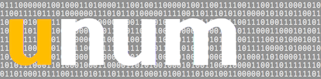

## about

Based on John Gustafson's **unum** ("Right Sizing Precision"), package `unum` provides variable length, tagged value, encoding of numeric values.

This implementation (as of now) only supports unsigned integers.

## spec

### `general encoding schema`

     byte order:  big-endian
     tag-bits:    high-order bits of first byte
     alignment:   byte aligned
     

-------
    

#### `UNUM-64`

The 2-bit tag determines the value-range and physical length of the image:

     tag        | bytes | range
     -----------+-------+------------------------------------------------
     00         | 1     | uint: (0, 2^6] 
     -----------+-------+------------------------------------------------
     01         | 2     | uint: (2^6, 2^14] 
     -----------+-------+------------------------------------------------
     10         | 4     | uint: (2^14, 2^30] 
     -----------+-------+------------------------------------------------
     11         | 8     | uint: (2^30, 2^62] 

**examples**

    uint64 :: 0x3b
    []byte :: {0x3b}

    uint64 :: 0x3bab
    []byte :: {0x7b, 0xab}

    uint64 :: 0x32febaab
    []byte :: {0xb2, 0xfe, 0xba, 0xab}

    uint64 :: 0x197f5d552fe8d5bc
    []byte :: {0xd9, 0x7f, 0x5d, 0x55, 0x2f, 0xe8, 0xd5, 0xbc}

-------

#### `UNUM-32`

The 2-bit tag determines the value-range and physical length of the image:

     tag        | bytes | range
     -----------+-------+------------------------------------------------
     00         | 1     | uint: (0, 2^6] 
     -----------+-------+------------------------------------------------
     01         | 2     | uint: (2^6, 2^14] 
     -----------+-------+------------------------------------------------
     10         | 3     | uint: (2^14, 2^22] 
     -----------+-------+------------------------------------------------
     11         | 4     | uint: (2^22, 2^30] 

**examples**

    uint32 :: 0x3b
    []byte :: {0x3b}

    uint32 :: 0x3bab
    []byte :: {0x7b, 0xab}

    uint32 :: 0x2a35c4
    []byte :: {0xaa, 0x35, 0xc4}

    uint32 :: 0x2fe8d5bc
    []byte :: {0xef, 0xe8, 0xd5, 0xbc}

-------
    
#### `UNUM-16`

The 1-bit tag determines the value-range and physical length of the image:

     tag        | bytes | range
     -----------+-------+------------------------------------------------
     0          | 1     | uint: (0, 2^7] 
     -----------+-------+------------------------------------------------
     1          | 2     | uint: (2^7, 2^15] 

**examples**

    uint16 :: 0x4b
    []byte :: {0x4b}

    uint16 :: 0x42fe
    []byte :: {0xc2, 0xfe}

-------

## usage

**Note**: Examples below use UNUM-64 encoding but the usage pattern is uniformly applicable.

#### `encode`

**using byte array**

	var value []uint64 = { .. }         
    var b []byte = ..           // provided by you
    
    // encoding to a byte buffer
    var offset int
    for _, v := range values {
        n, e := unum.EncodeUint(b[offset:], v)
        if e != nil {
            /* if e is ErrorBufferOverflow you could resize the buffer here */
            break
        }
        offset += n
    }

**using io.Writer **
 
    var w Writer = ..           // provider by you
    // encoding to a Writer
	for _, v := range values {
		_, e := unum.WriteUint(w, v)
		if e != nil {
			log.Fatalf("err - %s - value:%0x", e.Error(), v)
		}
	}
	 
#### `decode`

**using byte array**
 
    var b []byte = ..           // unum encoded buffer provided by you
    
    // decoding from a byte buffer
    var offset int
    for {
        v, n, e := unum.DecodeUint(b[offset:])
        if e != nil {
            break 
        }
        offset += n
    }
    
---

## License 

    The MIT License (MIT)
    
    Copyright (c) 2016 Joubin Muhammad Houshyar
    
    Permission is hereby granted, free of charge, to any person obtaining a copy of
    this software and associated documentation files (the "Software"), to deal in
    the Software without restriction, including without limitation the rights to
    use, copy, modify, merge, publish, distribute, sublicense, and/or sell copies of
    the Software, and to permit persons to whom the Software is furnished to do so,
    subject to the following conditions:
    
    The above copyright notice and this permission notice shall be included in all
    copies or substantial portions of the Software.
    
    THE SOFTWARE IS PROVIDED "AS IS", WITHOUT WARRANTY OF ANY KIND, EXPRESS OR
    IMPLIED, INCLUDING BUT NOT LIMITED TO THE WARRANTIES OF MERCHANTABILITY, FITNESS
    FOR A PARTICULAR PURPOSE AND NONINFRINGEMENT. IN NO EVENT SHALL THE AUTHORS OR
    COPYRIGHT HOLDERS BE LIABLE FOR ANY CLAIM, DAMAGES OR OTHER LIABILITY, WHETHER
    IN AN ACTION OF CONTRACT, TORT OR OTHERWISE, ARISING FROM, OUT OF OR IN
    CONNECTION WITH THE SOFTWARE OR THE USE OR OTHER DEALINGS IN THE SOFTWARE.

